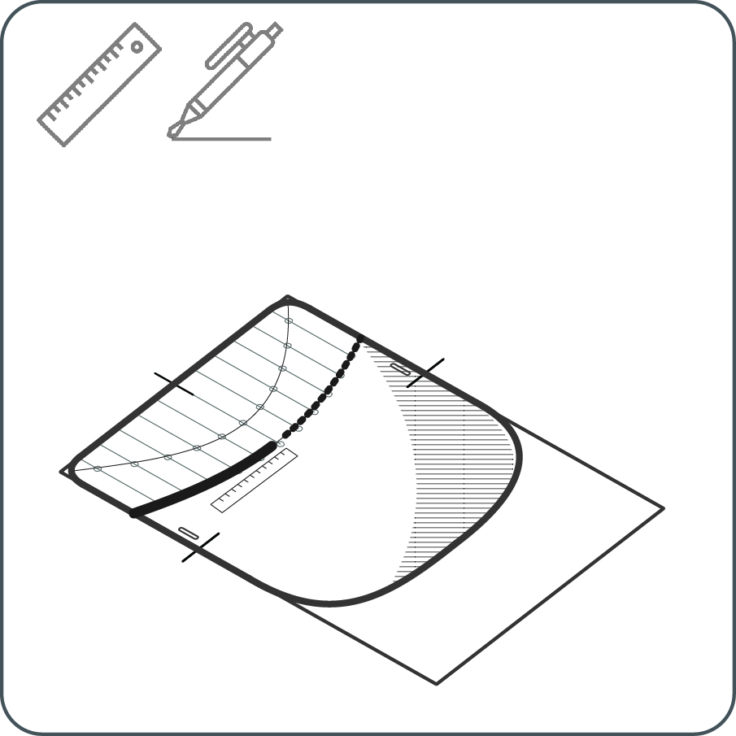

<i class="em em-timer_clock" aria-role="presentation" aria-label=""></i>: 10-15′

---

<iframe src="https://snapwidget.com/embed/810064" class="snapwidget-widget" allowtransparency="true" frameborder="0" scrolling="no" style="border:none; overflow:hidden;  width:100%; "></iframe>

---

---

## Sorumluluk Reddi

---

Cambridge Üniversitesi (UC) ve Queensland Üniversitesi (UQ), HappyShield'ın tasarımı, özellikleri, dayanıklılığı, uygun kullanımı veya performansı hakkında, satılabilirlik ve belirli bir amaca uygunluk hakkındaki zımni garantiyle sınırlı kalmamak üzere, açık veya zımni hiçbir garanti vermemektedir.  HappyShield, sıvılara ve spreylere maruz kalmayı en aza indirecek şekilde tasarlanmıştır, ancak UC ve UQ, HappyShield'ın kullanıcıları COVID-19 enfeksiyonundan veya başka bulaşıcı hastalıklardan koruyacağını garanti etmez. Bu materyaldeki hiçbir şey tıbbi tavsiye oluşturmaz ve kullanıcılar HappyShield'in amaçladıkları kullanıma uygun olup olmadığı ve diğer tıbbi veya başka türden stratejilerle birlikte kullanmaları gerekip gerekmediği konusunda kendi tıbbi tavsiyelerini takip etmelidirler. Yasaların izin verdiği azami ölçüde, UC ve UQ tüm zımni garantileri, güvenceleri, şartları ve koşulları hariç tutar. UC ve UQ, HappyShield'ın kullanımından kaynaklanan mülki hasar, bedensel yaralanma veya hastalık, ölüm, dolaylı, özel veya buna bağlı zararlar (“Talepler”) dahil ancak bunlarla sınırlı olmamak üzere herhangi bir hak, talep, hasar veya yaralanmadan sorumlu değildir, ve HappyShield kullanıcıları UC ve UQ'yu ve memurlarını, çalışanlarını, yüklenicilerini ve temsilcilerini tüm Taleplerden muaf tutar.

---

--- 

## Araçlar

---

* Makas ya da maket bıçağı
* Tükenmez kalem
* Cetvel
* Yemek bıçağı
* Yazıcı

---

## Malzemeler

---

**Siperlik**

* 0.5 mm kalınlığında polietilen tereftalat (PET) ya da asetat kağıdı 
* 20 mm genişliğinde elastik kayış (%70 polyester %30 kauçuk)
* Bant

---

---

# Talimatlar

---

# 1 

Kopyalama şablonunu indirin. A4 boyutundaki şablonlar A3 boyutundaki siperlikler içindir. Letter boyutundaki şablonlar Tabloid boyutundaki siperlikler içindir. Eğer yazıcıya erişim imkanınız yoksa, şablonda gösterilen boyutlara göre kendi şablonunuzu çizebilirsiniz.

---

# 2

Şeffaf levhayı şablonun üzerine yerleştirin. Kaleminizle kayış deliklerini işaretleyin. Mürekkep konusunda endişelenmeyin, alkol damlatılmış bir parça bezle çıkarılabilir. 

---

# 3

Kesmek için siperliğin sınırlarının üzerinden geçin. 

---

# 4

Makas veya maket bıçağı yardımıyla siperliğin dış sınırlarını kesin. Kayış deliklerini kesip çıkartın. Bunun için bir delgeç de kullanabilirsiniz.

Daha sonra maket bıçağı yardımıyla kayış tutacaklarını çıkartın.

Şimdi o surata bir gülücük yerleştirelim!

---

## Katlama Yöntemi A

---

# 5A

Şeffaf levhanızı şablonun üzerine yerleştirin. İzleri düzgün takip edebilmek için klips ya da bantla sabitleyin.

---

# 6A

Bir cetvel kullanarak ve basınç uygulayarak, sayfada görünür bir girinti görene kadar gerekirse 2-3 defa üstünden geçerek birbirini izleyen her nokta arasındaki düz parçaların üzerinden geçin.

---

# 7A

Şeffaf levhayı ters çevirin. Şablonu levhaya tekrar sabitleyin.

---

# 8A

İkinci eğrinin üzerinden de **6A** adımında olduğu gibi geçin.

---

## Katlama Yöntemi B

---

# 5B	

Tükenmez kalemle katlama eğrilerinin üzerinden geçin (burda ek basınç uygulamaya gerek yoktur). İsterseniz levhayı şablona klips ya da bant yardımıyla sabitleyebilirsiniz.

---

# 6B

Sabit bir çalışma yüzeyi ya da malzeme üzerinde en az 5 cm uzunluğunda 2-5 mm genişliğinde 2-3 mm derinliğinde bir oluk bulun. Döşeme tahtalarının ya da yemek masasının veya mutfak tezgahının birleşen parçaları arasındaki boşluklar işe yarayabilir. Alternatif olarak, kendi oluğunuzu bir parça tahta veya başka bir malzemeyle yapabilirsiniz. Ardından, bir tükenmez kalem veya nispeten küt bir uca sahip başka bir araç bulun (yemek bıçağının, kaşık veya çatalın herhangi bir küt kısmı iş görür).

Bir elinizle dikiş makinesinde bir parça bezi ilerletir gibi levhayı hareket ettirirken, öteki elinizle çizdiğiniz eğrilerden birini bulduğunuz araçla takip ederek tekrar tekrar oluğun üzerinden geçin. 

---

# 7B

Levhayı ters çevirin.

---

# 8B

6B adımını diğer eğri için tekrar edin.

---

# 9

Katlama eğrisinin bir ucundan başlayıp eğrinin diğer ucuna doğru ilerleyerek, eğri boyunca katlamak için levhayı yavaşça sıkıştırın. Bazı kısımlar kolayca katlanmıyorsa, katlama prosedürünü tekrarlayın. 

---

# 10

9. adımı diğer eğri için tekrar edin ancak bu sefer levhayı öteki yönde katlayın. 

---

# 11	

Kayışı tutacaklardan geçirin. Tutacakları siperliğin arka tarafından ön tarafına doğru deliklerden içeri sokun.

