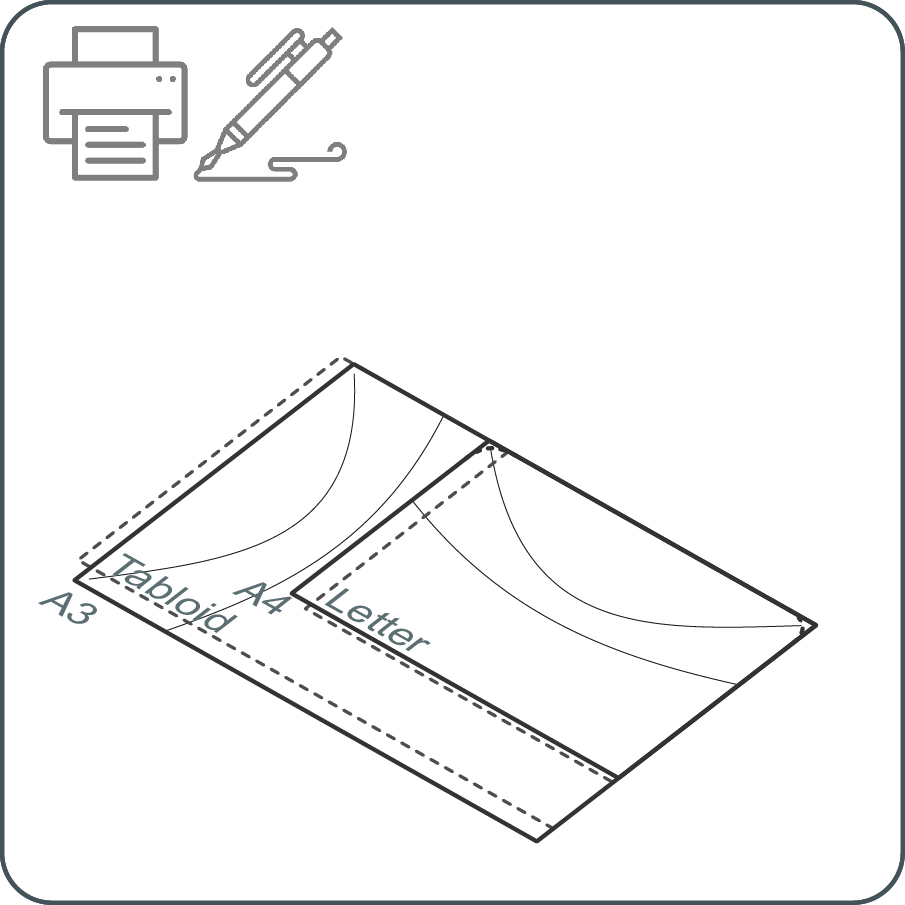

---
layout: page
title: الحز اليدوي
tagline: &nbsp  <a href="https://youtu.be/a7HmViDaAvk"><i class="em em-video_camera" aria-role="presentation" aria-label="VIDEO CAMERA"></i></a> <a href = "https://github.com/HappyShield/HappyShield/tree/master/Templates/HandCreasing" ><i class="em em-triangular_ruler" aria-role="presentation" aria-label="TRIANGULAR RULER"></i></a>
permalink: /hand-creasing/ar/
language: ar
---

<i class="em em-timer_clock" aria-role="presentation" aria-label=""></i>: 10-15′

---

<iframe src="https://snapwidget.com/embed/810064" class="snapwidget-widget" allowtransparency="true" frameborder="0" scrolling="no" style="border:none; overflow:hidden;  width:100%; "></iframe>

---

---

## إخلاء مسؤولية (Disclaimer)

---

The University of Cambridge (UC) and the University of Queensland (UQ) make no warranty of any kind, express or implied, about the design, characteristics, durability, proper use or performance of the HappyShield, including but not limited to implied warranties of merchantability and fitness for any particular purpose. The HappyShield is designed to minimise exposure to fluids and sprays, but UC and UQ do not warrant that HappyShield will protect users from COVID-19 infection or any other infectious disease. Nothing in this material constitutes medical advice, and users should seek their own medical advice about whether HappyShield is suitable for the use they intend, and whether they should use it in conjunction with any other medical or other strategies. To the fullest extent allowed by law, UC and UQ exclude all implied warranties, guarantees, terms and conditions. UC and UQ are not liable for any claims, demands, damages or injuries, including but not limited to property damage, bodily injury or illness, death, indirect, special or consequential damages (“the Claims”) arising out of using the HappyShield, and users of HappyShield release UC and UQ and their officers, employees, contractors and agents from all Claims.

---

--- 

## الأدوات

---

* مقص أو مشرط
* قلم حبر جاف
* مسطرة
* سكين زبدة
* طابعة

---

## المواد

---

**غطاء الوجه**

* نصف مم سماكة لوح بت البولي ايثيلين تيريفثاليت,  أو لوح شفاف اسيتات
* شريط مطاطي بعرض 20 مم . 70 بوليستر 30٪ مطاط
* شريط لاصق

---

---

# التعليمات

---

# 1 

قم بتحميل المخطط الخاص بغطاء الوجه من موقعنا.  إذا لم تتمكن من الوصول إلى طابعة ، يمكنك رسم المخطط الخاص بك باستخدام الأبعاد الموضحة في الرسمات المذكورة.

---

# 2

ضع الورقة الشفافة على المخطط. ضع علامة على موقع ثقوب الشريط باستخدام قلم التحديد. لا تقلق بشأن الحبر ، يمكن إزالته لاحقاً بقطعة قماش مبللة بالكحول.

---

# 3

قم برسم حدود غطاء الوجه باستخدام القلم أيضاً

---

# 4

قص حدود الغطاء باستخدام مقص أو مشرط. قم أيضاً بفتح ثقوب الشريط المطاطي. يمكنك استخدام خرامة الثقب لعمل هذه الثقوب.
بعد ذلك ، قص المستطيلات الصغيرة والتي ستقوم بتثبيت الشريط في غطاء الوجه.
سنقوم بعد ذلك بحز منحيين لطي الغطاء

---

## طريقة الحز A

---

# 5A

ضع الورقة الشفافة على المخطط وثبتها بشريط لاصق اودبوس ورق.

---

# 6A

باستخدام القلم والمسطرة قم بحز الورقة راسما الخطوط المستقيمة والتي تشكل المنحني وذلك بالضغط على القلم. للقيام بالحز, ربما تحتاج لتعليم الخط ثلاث او اربع مرات.
---

# 7A

اقلب الورقة الشفافة وثبتها مرة أخرى.

---

# 8A

 تتبع المنحنى الثاني بنفس الطريقة كما في الخطوة  قبل السابقة

---

## Creasing Method B

---

# 5B	

تتبع المنحنيات المرسومة باستخدام قلم. لايلزم ضغط اضافي على القلم هنا قم فقط برسم المنحني

---

# 6B

ستحتاج في هذه الطريقة لقناة (مجراية) بعمق 2-5 مم وعرض 2-3 مم وطول 5 سم. يمكنك عملها من قطعة من الخشب. كما يمكنك استخدامالفراغات الموجودة بين الواح الخشب في أرضية المنزل, او في طاولة الطعام او المطبخ, أي قناة باعاد مشابهة للتي ذكرناها سابقاً يمكن أن تعمل. 
بعد ذلك ، باستخدام اي اداة ذات حرف غير حاد, سكين زبدة أو قلم جاف, قم بتحديد وحز المنحني وذلك بتثبيت اليد التي تحمل القلم ولف الغطاء وتحريكه في اليد الأخرى.

---

# 7B

قم بقلب غطاء الوجه 

---

# 8B

كرر العملية كما في الخطوة  قبل السابقة

---

# 9

قم بطي الغطاء, ابدأ من نهاية منحني الحز, اصغط برفق على طرفي الغطاء وقم بالطي حتى النهاية الاخرى للمنحني. في حال كانت بعض الاجزاء غير سهلة في طيها, كرر اجراء الحز في هذا الجزء. 

---

# 10

كرر الخطوة 9 لمنحنى الحز الآخر ، ولكن هذه المرة ، قم بطي الورقة في الاتجاه الآخر.

---

# 11	

مرر الشريط من خلال مستطيلات التثبيت. مرر المستطيلات عبر الفتحات الموجودة في غطاء من الجانب الخلفي إلى الأمام.

