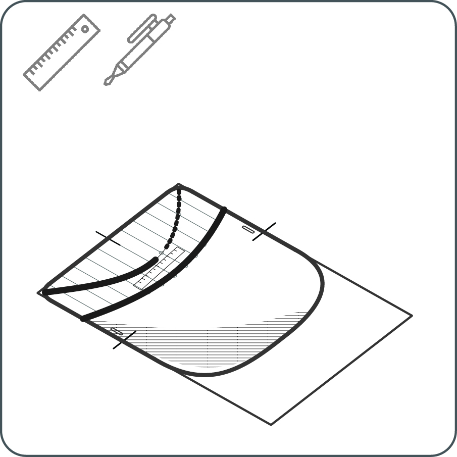

<i class="em em-timer_clock" aria-role="presentation" aria-label=""></i>: 10-15′

---

<iframe src="https://snapwidget.com/embed/810064" class="snapwidget-widget" allowtransparency="true" frameborder="0" scrolling="no" style="border:none; overflow:hidden;  width:100%; "></iframe>

---

---

## 免责声明（Disclaimer）

---
剑桥大学（UC）和昆士兰大学（UQ）对HappyShield的设计，特征，耐用性，正确使用或性能不做任何形式的明示或暗示保证，包括但不限于以下隐含保证：适销性和适合任何特定目的。 HappyShield旨在最大程度减少液体和喷雾的接触，但是UC和UQ不保证HappyShield可以保护用户免受COVID-19感染或任何其他传染病的侵害。本材料中的任何内容均不构成医学建议，就HappyShield是否适合其预期用途以及是否能与任何其他医学手段或策略联用，用户须自行征询医学建议。在法律允许的最大范围内，UC和UQ排除所有隐含的担保，保证，条款和条件。 UC和UQ对因使用HappyShield而引起的任何索赔，要求，损害或伤害不承担任何责任，包括但不限于财产损失，人身伤害或疾病，死亡，间接，特殊或附带损失（以下简称“索赔”）。HappyShield的用户不得对UC和UQ及其官员，雇员，承包商和代理商提起以上“索赔”。（具体声明以英文版为准）

The University of Cambridge (UC) and the University of Queensland (UQ) make no warranty of any kind, express or implied, about the design, characteristics, durability, proper use or performance of the HappyShield, including but not limited to implied warranties of merchantability and fitness for any particular purpose. The HappyShield is designed to minimise exposure to fluids and sprays, but UC and UQ do not warrant that HappyShield will protect users from COVID-19 infection or any other infectious disease. Nothing in this material constitutes medical advice, and users should seek their own medical advice about whether HappyShield is suitable for the use they intend, and whether they should use it in conjunction with any other medical or other strategies. To the fullest extent allowed by law, UC and UQ exclude all implied warranties, guarantees, terms and conditions. UC and UQ are not liable for any claims, demands, damages or injuries, including but not limited to property damage, bodily injury or illness, death, indirect, special or consequential damages (“the Claims”) arising out of using the HappyShield, and users of HappyShield release UC and UQ and their officers, employees, contractors and agents from all Claims.

---

--- 

## 工具

---

* 剪刀 或 刻刀
* 圆珠笔
* 直尺
* 黄油刀
* 打印机

---

## 材料

---

**护罩**

* 0.5 毫米厚的PET聚酯塑片 或者至少是 醋酸纤维塑片 (Acetate sheet) 
* 20 毫米宽的针织松紧带(70%聚酯，30%橡胶)
* 胶带

---

---

# 制作步骤

---

# 1 

下载临摹模板。A4大小(210毫米x297毫米)的模板用于制作A3大小(297毫米x420毫米)的护罩。信纸大小(Letter-sized,216毫米x279毫米)模板用于制作小报大小(Tabloid-sized,279毫米x432毫米)的护罩。如果没有打印机，可按模板上标注的尺寸自行绘制。

---

# 2

将准备的透明塑片放在模板上。用马克笔或圆珠笔标记两边松紧带孔的位置。不用担心画在塑片上的笔墨，可以用布蘸酒精将其擦去。

---

# 3

按模板描边用于裁剪护罩。

---

# 4

用剪刀或刻刀沿描边裁出护罩的形状。按之前标记的位置抠剪或抠刻出松紧带孔。也可以用打孔器打孔。

接着，用刀刻出防滑固定夹(friction clips)。

现在，我们可以在护罩上做“笑脸”了！

---

## 压褶方法A

---

# 5A

将透明塑片放于模板上，用回形针或胶带对齐固定。

---

# 6A

用直尺沿着圆点连接的直线（如图中加粗线）施加压力，多刮划几次直到护罩上出现肉眼可见的凹痕为止。

---

# 7A

将透明塑片翻面，重新与模板对齐固定。

---

# 8A

采用与步骤**6A**一样的方法沿着第二条曲线压褶。

---

## 压褶方法B

---

# 5B	

用笔在护罩上描出需要弯折的曲线（无须施加压力）。如果不好描准，可以用回形针或胶带对齐固定塑片和模板。

---

# 6B

找一个固定台面或面板，面上须有2-5毫米宽、2-3毫米深和至少5厘米长凹沟。可以是地砖接缝、有凹陷条案的餐桌或厨房台面。另外，也可以在木头或其他材料的表面上自己做一个这样的凹沟。接着，找个圆珠笔或者末端比较钝的工具（可以是黄油刀，铁勺或细筷子）。

与用缝纫机缝布的操作类似，一只手推动塑片沿画好的折线在台面上移动，并保证凹沟始终对准折线，另一只手用钝工具反复将塑片向凹沟按压。

---

# 7B

将塑片翻面。

---

# 8B

沿另外一条折线重复步骤6B的操作。

---

# 9

沿压好的褶线从一边向另一边轻轻地捏折直到塑片完全弯折到一侧。如果有些部分无法捏折，可以重复之前的压褶步骤。

---

# 10

沿另外一条褶线重复步骤9，不过这次是将它向相反方向弯折。

---

# 11	

将松紧带与两个防滑固定夹连接。将连接好的防滑夹从护罩带孔向前穿出。

