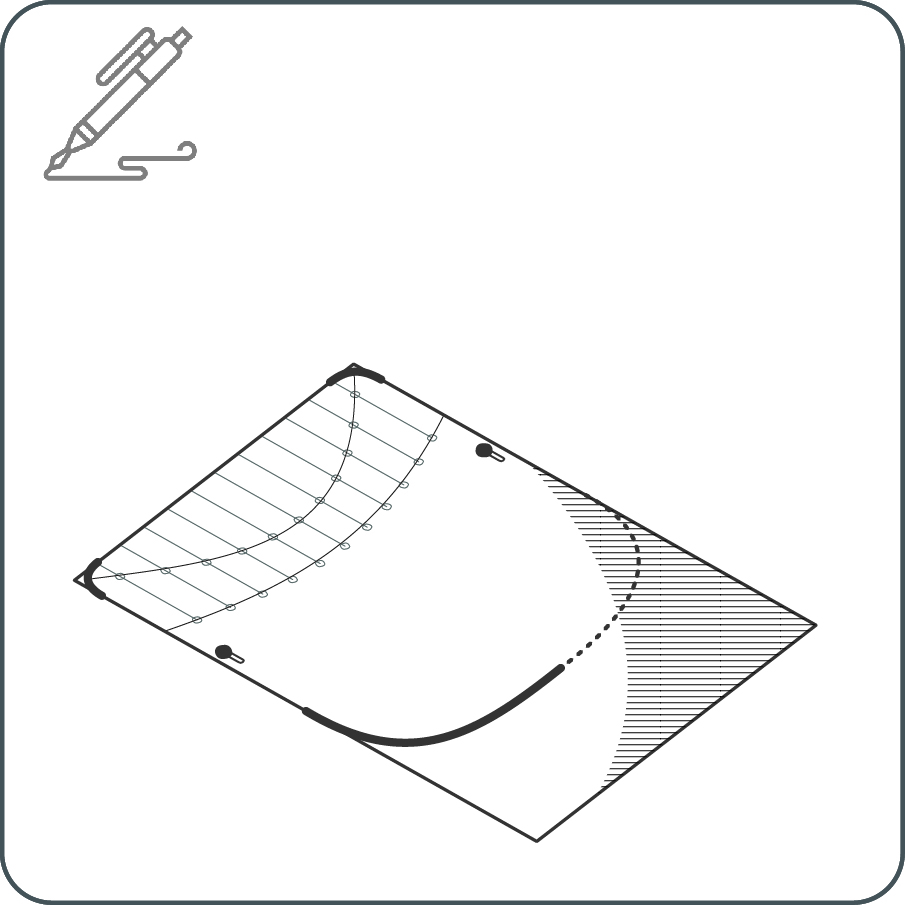
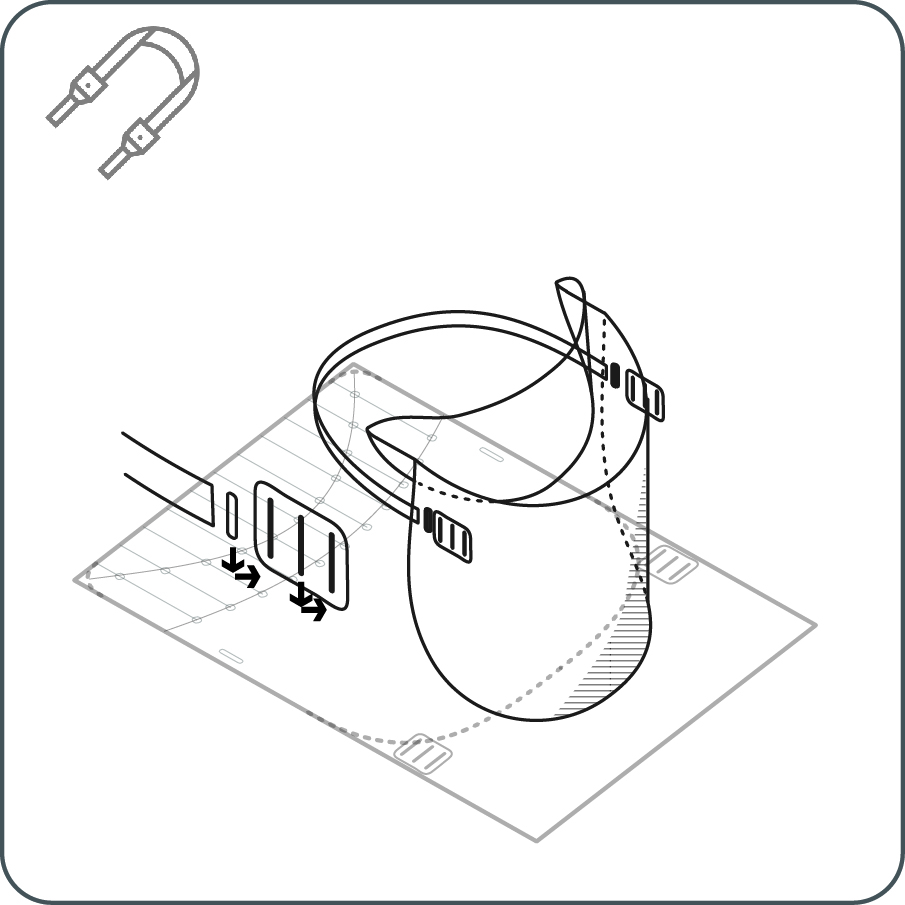

<i class="em em-timer_clock" aria-role="presentation" aria-label=""></i>: 10-15′

---

<iframe src="https://snapwidget.com/embed/810064" class="snapwidget-widget" allowtransparency="true" frameborder="0" scrolling="no" style="border:none; overflow:hidden;  width:100%; "></iframe>

---

---

## Disclaimer

---

มหาวิทยาลัยเคมบริดจ์ (UC) และมหาวิทยาลัยควีนส์แลนด์ (UQ) ไม่รับประกันใด ๆ ไม่ว่าโดยชัดแจ้งหรือโดยนัยเกี่ยวกับการออกแบบลักษณะความทนทานการใช้งานที่เหมาะสมหรือประสิทธิภาพของ Happy Shield รวมถึง แต่ไม่ จำกัด เพียงการรับประกันโดยนัยของ การค้าและความเหมาะสมสำหรับวัตถุประสงค์เฉพาะใด ๆ Happy Shield ออกแบบมาเพื่อลดการสัมผัสของเหลวและสเปรย์ให้น้อยที่สุด แต่ UC และ UQ ไม่รับประกันว่า Happy Shield จะปกป้องผู้ใช้จากการติดเชื้อ COVID-19 หรือโรคติดเชื้ออื่น ๆ ไม่มีสิ่งใดในเอกสารนี้ที่มีคำแนะนำทางการแพทย์และผู้ใช้ควรขอคำแนะนำทางการแพทย์ของตนเองว่า Happy Shield เหมสมกับการใช้งานที่พวกเขาต้องการหรือไม่และควรใช้ร่วมกับกลยุทธ์ทางการแพทย์อื่น ๆ หรือไม่ ตามขอบเขตสูงสุดที่กฎหมายอนุญาต UC และ UQ ไม่รวมการรับประกันการรับประกันข้อกำหนดและเงื่อนไขโดยนัยทั้งหมด UC และ UQ จะไม่รับผิดชอบต่อการเรียกร้องความต้องการความเสียหายหรือการบาดเจ็บใด ๆ รวมถึง แต่ไม่ จำกัด เฉพาะความเสียหายของทรัพย์สินการบาดเจ็บทางร่างกายหรือการเจ็บป่วยความตายทางอ้อมความเสียหายพิเศษหรือความเสียหายอื่น ๆ ที่เกิดขึ้น (“ การเรียกร้อง”) และผู้ใช้ Happy Shield จะเปิดตัว UC และ UQ รวมถึงเจ้าหน้าที่พนักงานผู้รับเหมาและตัวแทนจากการเรียกร้องทั้งหมด

---

--- 

## อุปกรณ์

---

* กรรไกร หรือ มีดโกน
* ปากกา
* ไม้บรรทัด
* มีดทาเนย
* เครื่องพิมพ์

---

## วัสดุ

---

**ตัวหน้ากาก**

* แผ่นพลาสติก PET หรือ Acetate หนาอย่างน้อย 0.5 มิลลิเมตร
* ยางยืดทำมาจาก 70 % polyester + 30% rubber กว้าง 20 มิลลิเมตร
* เทปกาว

---

---

# คำแนะนำ

---

# 1 

ดาวน์โหลดแบบหน้ากากขนาด A4 สำหรับหน้ากากขนาด A3 และแบบหน้ากากขนาดจดหมาย สำหรับหน้ากากขนาด tabloid หรือถ้าไม่สามารถปริ้นต์แบบหน้ากากออกมาได้ ให้วาดแบบหน้ากากตามขนาดที่แสดงอยู่ในแบบหน้ากากนั้นๆ 

---

# 2

วางแผ่นพลาสติก PET หรือ Acetate บนแบบหน้ากาก แล้วทำเครื่องหมายบริเวณที่จะต้องเจาะรูด้วยปากกา (หมึกจากปากกาสามารถลบได้ด้วยแอลกอฮอล์หลังจากทำหน้ากากเสร็จ)

---

# 3

วาดแบบหน้ากากลงบนแผ่นพลาสติก

---

# 4

ตัดแผ่นพลาสติกตามแบบและเจาะรู 

---

## การทำหน้ากากแบบ A

---

# 5A

วางแผ่นพลาสติกลงบนแบบหน้ากาก แล้วเอาคลิปหรือเทปกาวติดไว้ เพื่อป้องกันการขยับเขยื่อน

---

# 6A

ใช้ไม้บรรทัด กรีดตามรอย 2 - 3 รอบ จนให้เห็นรอยบนแผ่นพลาสติกชัดเจน

---

# 7A

วางแผ่นพลาสติกลงบนแบบหน้ากากอีกครั้ง แล้วเอาคลิปหรือเทปกาวติดได้ 

---

# 8A

ทำอีกรอยพับ โดยทำเหมือนข้อ **6A**.

---

## การทำหน้ากากแบบ B

---

# 5B	

ทำรอยพับบนแผ่นพลาสติกด้วยปากกา (ไม่ต้องใช้แรงกดเยอะ) ถ้ากลัวว่าแผ่นพลาสติกไม่ตรงกับแบบหน้ากาก ให้ใช้คลิปหรือเทปกาวยึดแผ่นพลาสติกกับแบบหน้ากากให้แน่น

---

# 6B

หาร่องตามพื้นโต๊ะที่มีความกว้างประมาณ 2-5 มิลลิเมตร ลึกประมาณ 2-3 มิลลิเมตร และยาวอย่างน้อย 5 เซนติเมตร หรือทำขึ้นมาเอง หลังจากนั้น ใช้ปากกาหรืออุปกรณ์อื่นๆที่ไม่มีคมเช่น มีดทาเนย ช้อน หรือตะเกียบ มาทำรอยพับ  

โดยวิธีการทำรอยพับจะคล้ายกับการเย็บผ้า คือ ค่อยๆขยับแผ่นพลาสติกและใช้ปากกาทำรอยพับบนร่องตามพื้นโต๊ะไปพร้อมๆกัน ทำซ้ำหลายๆครั้งจนเกิดรอยพับชัดเจนบนแผ่นพลาสติก

---

# 7B

กลับด้านแผ่นพลาสติก

---

# 8B

ทำซ้ำตามข้อ 6B

---

# 9

ไล่พับตามรอบพับ จากมุมด้านหนึ่งไปยังมุมอีกด้านหนึ่ง โดยถ้ารอยพับยังพับยากอยู่ หรือไม่เป็นรอยสวยงาม ให้กลับไปทำขั้นตอนการพับใหม่

---

# 10

ทำซ้ำขั้นตอนที่ 9 จนครบทุกรอยพับ โดยพับสลับด้านกัน

---

# 11	

ร้อยยางยืดจากด้านหลังของหน้ากากไปด้านหน้าของหน้ากาก แล้วใช้คลิปหนีบไว้

