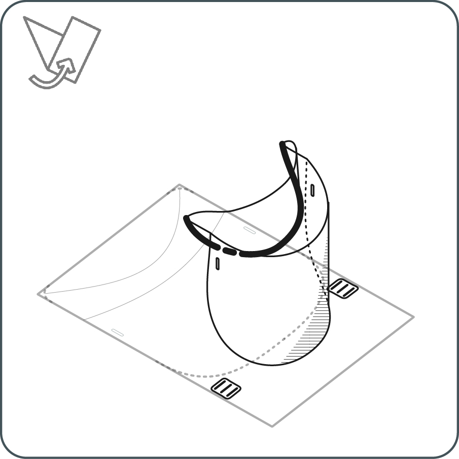

<iframe src="https://snapwidget.com/embed/810074" class="snapwidget-widget" allowtransparency="true" frameborder="0" scrolling="no" style="border:none; overflow:hidden;  width:100%; "></iframe>

---

## Disclaimer

---

Finalised disclaimer text will go here. 

**Temporary disclaimer**: the face shields associated with these instructions have not yet been clinically approved by medical professionals. Please follow the guidance of the relevant authorities to ensure the safety of yourself and others. This design has been tested for the following materials, tools, and methods. If you do choose to use materials, tools, or methods not described here, please do so at your own risk.

--- 

## Tools

---

* Laser-cutter
* Scissors or razor blade

---

## Materials

---

**Shield**

* 0.5 mm thick Polyethylene terephthalate (PET) or Acetate sheet at least 
* 20 mm wide knit elastic strap (70% polyester 30% rubber)

---

---

# Instructions

---

## Disclaimer

Disclaimer text here. 

Temporary disclaimer: the face shields associated with these instructions have not yet been clinically approved by medical professionals. Please follow the guidance of the relevant authorities to ensure the safety of yourself and others.

---

This design has been tested for the following materials, tools, and methods. If you do choose to use materials, tools, or methods not described here, please do so at your own risk.

## Tools

## Materials

### Sheet Materials

* 0.5 mm thick polyethylene terephthalate (PET)
* 0.5 mm thick acetate

### Strap

* 20 mm wide Knit Elastic (70% polyester 30% rubber)

---

# 1

Laser-cut the clear plastic sheet material using the template file, ensuring that your laser-cutter power and speed settings ensure a cut completely through the depth of the material.

---

# 2	

Starting on end of one of the crease curves, and working your way to the other end of the curve, gently pinch the sheet to fold it along the curve. 

--- 

# 3 	

Fold the second curve using the same procedure as in Step 2.

---

# 4	

Thread the strap through the friction clips. Pass the friction clips through the holes in the shield from the back side of the shield to the front.

