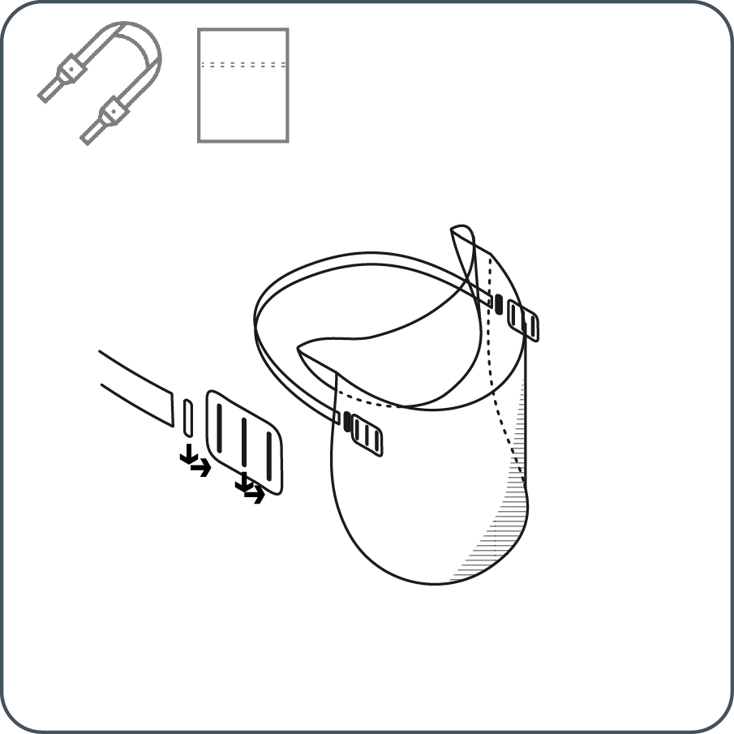

<iframe src="https://snapwidget.com/embed/811086" class="snapwidget-widget" allowtransparency="true" frameborder="0" scrolling="no" style="border:none; overflow:hidden;  width:100%; "></iframe>

---

## Aviso Legal

---

A Universidade de Cambrigde (UC) e a Universidade de Queensland (UQ) não fazem qualquer garantia, expressa ou implícita, sobre o design, características, durabilidade, uso e desempenho do HappyShield, incluindo mas não limitado às garantias implícitas da sua comercialização e aplicação para qualquer uso particular. O HappyShield está desenhado para minimizar a exposição a fluídos e sprays, mas a UC e a UQ não garantem que o HappyShield proteja os seus utilizadores da infeção por COVID-19 ou qualquer outra doença infeciosa. Nada nestas instruções constitui conselhos médicos, e os utilizadores devem procurar o seus próprios conselhos médicos sobre se o HappyShield é adequado para o uso pretendido, e se o devem utilizar em conjunto com outros dispositivos médicos e estratégias. Na extensão mais completa da lei, a UC e a UQ excluem todas as garantias implícitas, garantias, termos e condições. A UC e a UQ não se responsabilizam por quaisquer queixas, reivindicações, estragos ou acidentes, incluindo mas não limitado a estragos materiais, danos físicos ou doenças, morte, “Reclamações” indiretas, específicas ou consequenciais da utilização do HappyShield, e os utilizadores do HappyShield ilibam a UC e a UQ e os seus administradores, empregados, contratos e agentes de todas as reivindicações.

---

--- 

## Ferramentas

---

* Cortador a laser
* Tesoura ou lâmina de corte

---

## Materiais

---

**Viseira**

* Polietileno tereftalato (PET) com 0,5 mm de espessura ou como alternativa uma folha de acetato 
* Fita elástica larga de 20 mm (70% poliéster 30% borracha)

---

---

# Instruções

---

# 1

Corte a laser a folha de plástico transparente usando o modelo, assegurando que as configurações do cortador a laser proporcionam a potência e velocidade necessárias para cortar o material na totalidade da sua espessura.

---

# 2	

Começando numa ponta da curva dobrável, e lentamente até à outra ponta, aperte gentilmente a folha para a dobrar ao longo da curva. 

--- 

# 3 	

Dobre a segunda curva usando o mesmo procedimento que no passo 2.

---

# 4	

Passe o elástico pelos clipes de fricção. Passe os clipes de fricção pelos orifícios na viseira de trás para a frente.

