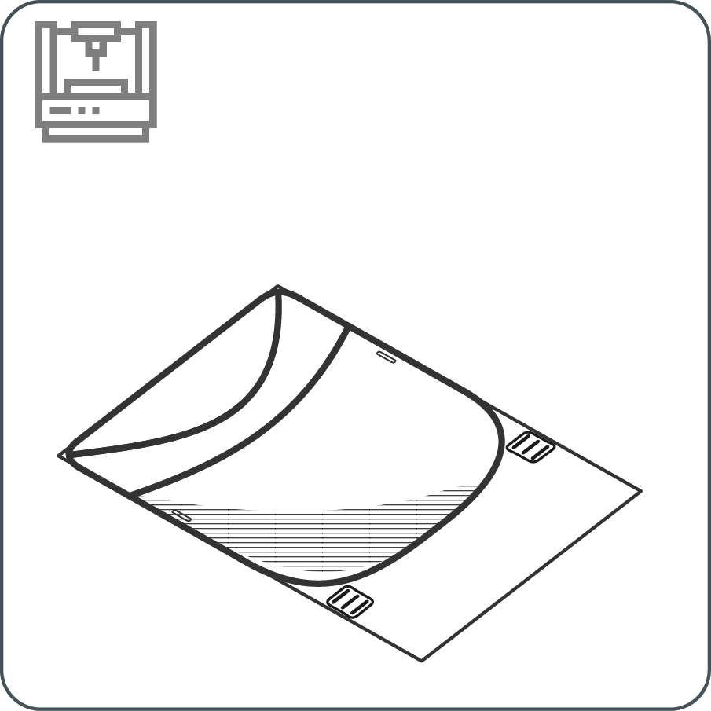

<iframe src="https://snapwidget.com/embed/811086" class="snapwidget-widget" allowtransparency="true" frameborder="0" scrolling="no" style="border:none; overflow:hidden;  width:100%; "></iframe>

---

## Aviso Legal (Disclaimer)

---

The University of Cambridge (UC) and the University of Queensland (UQ) make no warranty of any kind, express or implied, about the design, characteristics, durability, proper use or performance of the HappyShield, including but not limited to implied warranties of merchantability and fitness for any particular purpose. The HappyShield is designed to minimise exposure to fluids and sprays, but UC and UQ do not warrant that HappyShield will protect users from COVID-19 infection or any other infectious disease. Nothing in this material constitutes medical advice, and users should seek their own medical advice about whether HappyShield is suitable for the use they intend, and whether they should use it in conjunction with any other medical or other strategies. To the fullest extent allowed by law, UC and UQ exclude all implied warranties, guarantees, terms and conditions. UC and UQ are not liable for any claims, demands, damages or injuries, including but not limited to property damage, bodily injury or illness, death, indirect, special or consequential damages (“the Claims”) arising out of using the HappyShield, and users of HappyShield release UC and UQ and their officers, employees, contractors and agents from all Claims.

---

--- 

## Ferramentas

---

* Cortador a laser
* Tesoura ou lâmina de corte

---

## Materiais

---

**Viseira**

* Polietileno tereftalato (PET) com 0,5 mm de espessura ou como alternativa uma folha de acetato 
* Fita elástica larga de 20 mm (70% poliéster 30% borracha)

---

---

# Instruções

---

# 1

Corte a laser a folha de plástico transparente usando o modelo, assegurando que as configurações do cortador a laser proporcionam a potência e velocidade necessárias para cortar o material na totalidade da sua espessura.

---

# 2	

Começando numa ponta da curva dobrável, e lentamente até à outra ponta, aperte gentilmente a folha para a dobrar ao longo da curva. 

--- 

# 3 	

Dobre a segunda curva usando o mesmo procedimento que no passo 2.

---

# 4	

Passe o elástico pelos clipes de fricção. Passe os clipes de fricção pelos orifícios na viseira de trás para a frente.

