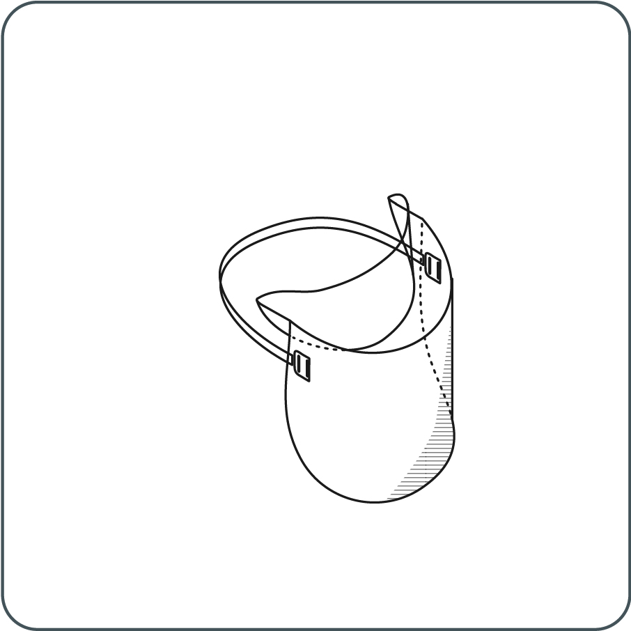

<iframe src="https://snapwidget.com/embed/810066" class="snapwidget-widget" allowtransparency="true" frameborder="0" scrolling="no" style="border:none; overflow:hidden;  width:100%; "></iframe>

---

## Aviso Legal (Disclaimer)

---

The University of Cambridge (UC) and the University of Queensland (UQ) make no warranty of any kind, express or implied, about the design, characteristics, durability, proper use or performance of the HappyShield, including but not limited to implied warranties of merchantability and fitness for any particular purpose. The HappyShield is designed to minimise exposure to fluids and sprays, but UC and UQ do not warrant that HappyShield will protect users from COVID-19 infection or any other infectious disease. Nothing in this material constitutes medical advice, and users should seek their own medical advice about whether HappyShield is suitable for the use they intend, and whether they should use it in conjunction with any other medical or other strategies. To the fullest extent allowed by law, UC and UQ exclude all implied warranties, guarantees, terms and conditions. UC and UQ are not liable for any claims, demands, damages or injuries, including but not limited to property damage, bodily injury or illness, death, indirect, special or consequential damages (“the Claims”) arising out of using the HappyShield, and users of HappyShield release UC and UQ and their officers, employees, contractors and agents from all Claims.

---

--- 

## Ferramentas

---

* Cortador a laser
* Prensa de 10 toneladas
* Alicate capaz de cortar cabo de aço com 1 mm
* Tesoura ou lâmina de corte
* Berbequim ou chave de fendas

---

## Materiais

---

**Estrutura de 3 partes para a prensa**

* MDF de 4 mm
* Cabo de aço com 1 mm   
* Parafusos de madeira de 6-20 mm
* Fita adesiva transparente

**Viseira**

* Polietileno tereftalato (PET) com 0,5 mm de espessura ou como alternativa uma folha de acetato
* Fita elástica larga de 20 mm (70% poliéster 30% borracha)

---

---

# Instruções

---

## Estrutura de 3 peças para a prensa

---

# 1 	

Descarregue o modelo da estrutura de 3 peças para a prensa com as dimensões apropriadas para a o seu cortador a laser. (As dimensões dos modelos de corte estão descritas no nome do ficheiro.) Corte a laser o MDF usando o modelo do ficheiro.

---

# 2

Remova a estrutura de 3 peças para a prensa do cortador a laser. Corte o cabo de aço com o comprimento das curvas dobráveis das partes A e C do modelo.
Com a fita adesiva, prenda o cabo de aço na ranhura da curva dobrável das partes A e C da estrutura da prensa, garantindo que o cabo de aço não se desvia da curva dobrável, nem se estende para além da mesma. 

---

# 3

Junte a parte B ao topo da parte A usando parafusos de madeira curtos. Junte a combinação das partes A e B a um bloco distribuindo a pressão uniformemente pela superfície da estrutura. Faça o mesmo para a parte C.

--- 

## Viseira

---

# 1

Descarregue o modelo da viseira com as dimensões apropriadas para a o seu cortador a laser. (As dimensões dos modelos de corte estão descritas no mome do ficheiro.)

---

# 2	

Corte a laser a folha transparente usando o modelo do ficheiro, assegurando que as configurações da potência e velocidade do cortador a laser são as indicadas para cortar completamente o material na sua profundidade. 

Uma vez cortado, remova a viseira e os clipes de fricção do cortador a laser. Se desejar, limpe as margens da viseira e dos clipes de fricção com álcool, ou lave com água e sabão para remover quaisquer resíduos do cortador a laser. 

--- 

# 3

Insira a viseira na estrutura de três partes da prensa e prense para criar as curvas dobráveis. 

---

# 4	

Corte 400 mm de comprimento de fita elástica. Passe as duas pontas do elástico pelos clipes de fricção.

---

# 5	

Passe os clipes de fricção pelos orifícios na viseira de trás para a frente 

