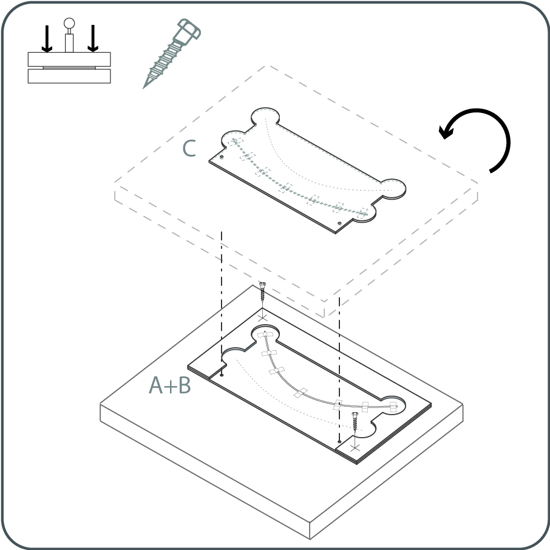
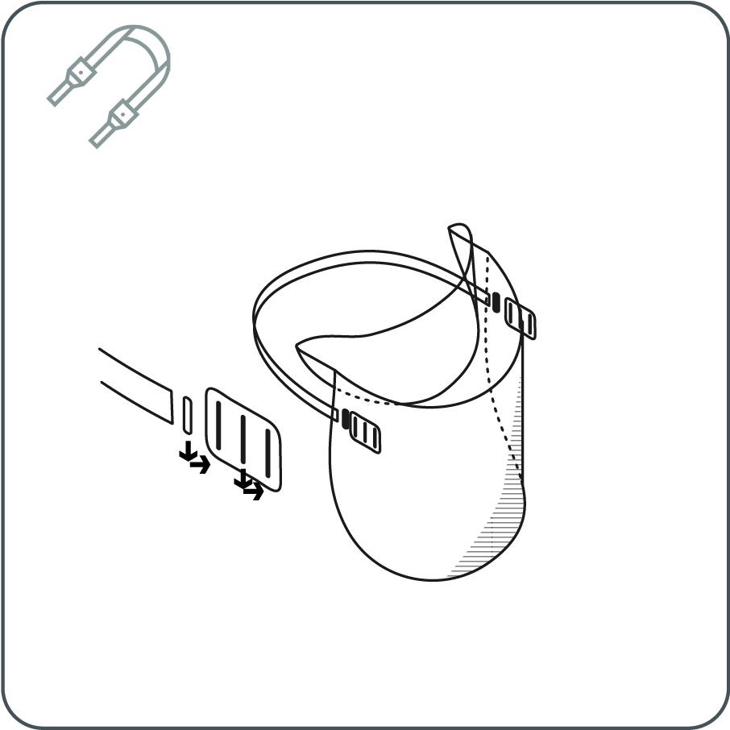

---
layout: page
title: Laser Kesim ve Basınçlı Katlama
tagline: &nbsp  <a href = "https://youtu.be/IPKiPi-Tne8"><i class="em em-video_camera" aria-role="presentation" aria-label="VIDEO CAMERA"></i></a> <a href = "https://github.com/HappyShield/HappyShield/tree/master/Templates/LaserCutAndPressureCreasing" ><i class="em em-triangular_ruler" aria-role="presentation" aria-label="TRIANGULAR RULER"></i></a>
permalink: /pressure-creasing/tr/
---

<iframe src="https://snapwidget.com/embed/810066" class="snapwidget-widget" allowtransparency="true" frameborder="0" scrolling="no" style="border:none; overflow:hidden;  width:100%; "></iframe>

---

##  Sorumluluk Reddi

---

Cambridge Üniversitesi (UC) ve Queensland Üniversitesi (UQ), HappyShield'ın tasarımı, özellikleri, dayanıklılığı, uygun kullanımı veya performansı hakkında, satılabilirlik ve belirli bir amaca uygunluk hakkındaki zımni garantiyle sınırlı kalmamak üzere, açık veya zımni hiçbir garanti vermemektedir. HappyShield, sıvılara ve spreylere maruz kalmayı en aza indirecek şekilde tasarlanmıştır, ancak UC ve UQ, HappyShield'ın kullanıcıları COVID-19 enfeksiyonundan veya başka bulaşıcı hastalıklardan koruyacağını garanti etmez. Bu materyaldeki hiçbir şey tıbbi tavsiye oluşturmaz ve kullanıcılar HappyShield'in amaçladıkları kullanıma uygun olup olmadığı ve diğer tıbbi veya başka türden stratejilerle birlikte kullanmaları gerekip gerekmediği konusunda kendi tıbbi tavsiyelerini takip etmelidirler. Yasaların izin verdiği azami ölçüde, UC ve UQ tüm zımni garantileri, güvenceleri, şartları ve koşulları hariç tutar. UC ve UQ, HappyShield'ın kullanımından kaynaklanan mülki hasar, bedensel yaralanma veya hastalık, ölüm, dolaylı, özel veya buna bağlı zararlar (“Talepler”) dahil ancak bunlarla sınırlı olmamak üzere herhangi bir hak, talep, hasar veya yaralanmadan sorumlu değildir, ve HappyShield kullanıcıları UC ve UQ'yu ve memurlarını, çalışanlarını, yüklenicilerini ve temsilcilerini tüm taleplerden muaf tutar.

---

--- 

## Aletler

---

* Lazer kesici
* 10 tonluk baskı makinesi
* 1mm'lik çelik tel kabloyu kesebilecek pense
* Makas veya maket bıçağı
* Matkap veya tornavida

---

## Malzemeler

---

**3-Parçalı Baskı Şablonu**

* 4 mm MDF
* 1 mm çelik tel kablo
* 6-20 mm ahşap vida
* Şeffaf plastik bant

**Siperlik**

* 0.5 mm kalınlığında Polyethylene terephthalate (PET) veya Asetat Sayfa
* 20 mm genişliğinde elastik bant (70% polyester 30% lastik)

---

---

# Açıklamalar

---

## 3-Parçalı Baskı Şablonu

---

# 1 	

Lazer kesicinizin yatağına uyacak 3 parçalı baskı şablonunu sitemizden indirin. (Baskı şablonlarının ölçüleri dosya isimlerinde belirtilmiştir.) MDF'yi şablonu kullanarak kesin.

---
# 2

Baskı şablonunun 3 parçasını lazer kesiciden çıkarın. Çelik kabloyu şablonun A ve C kısımlarındaki kesikli çizgili eğrilerin uzunluğunda kesin. Çelik kabloyu baskı şablonunun A ve C kısımlarındaki çizgili eğrilerin olukları boyunca bantlayın. Çizgili eğrinin hizasından taşmadığınızdan ve eğrinin bittiği yerde bitirdiğinizden emin olun.

---
# 3

B parçasını A parçasının üstüne gelecek şekilde ahşap vidalarla birleştirin. Birleştirilmiş A ve B parçalarını şablon yüzeyinde basıncı eşit yayması için bir bloğa ekleyin. C parçası için de aynısını yapın.

--- 
## Siperlik

---

# 1

Lazer kesicinizin yatağına uyacak şablonu sitemizden indirin. (Baskı şablonlarının ölçüleri dosya isimlerinde belirtilmiştir.)

---

# 2	

Şeffaf plastik levhayı şablonu kullanarak lazer kesiciyle kesin. Lazer kesici güç ve hız ayarlarının malzemeyi derinliğince tamamen kesecek şekilde ayarlandığından emin olun. 

Kesilmiş siperlikleri ve sıkıştırma klipslerini lazer kesicinin yatağından çıkarın. Isterseniz, lazer kesim artıklarını gidermek için siperliklerin ve klipslerin köşelerini alkolle silebilir ya da sabunla yıkayabilirsiniz. 

--- 

# 3

Siperliği 3 parçalı baskı şablonuna yerleştirin ve eğrili katlarmaları oluşturmak için bastırın.

---

# 4	

400 mm uzunluğunda bir elastik bant kesin. Bantın 2 ucunu sıkıştırma klipslerinden geçirin.

---

# 5	

Dişli klipsleri sperliğin üzerindeki deliklerden arkadan öne doğru geçirin. 
