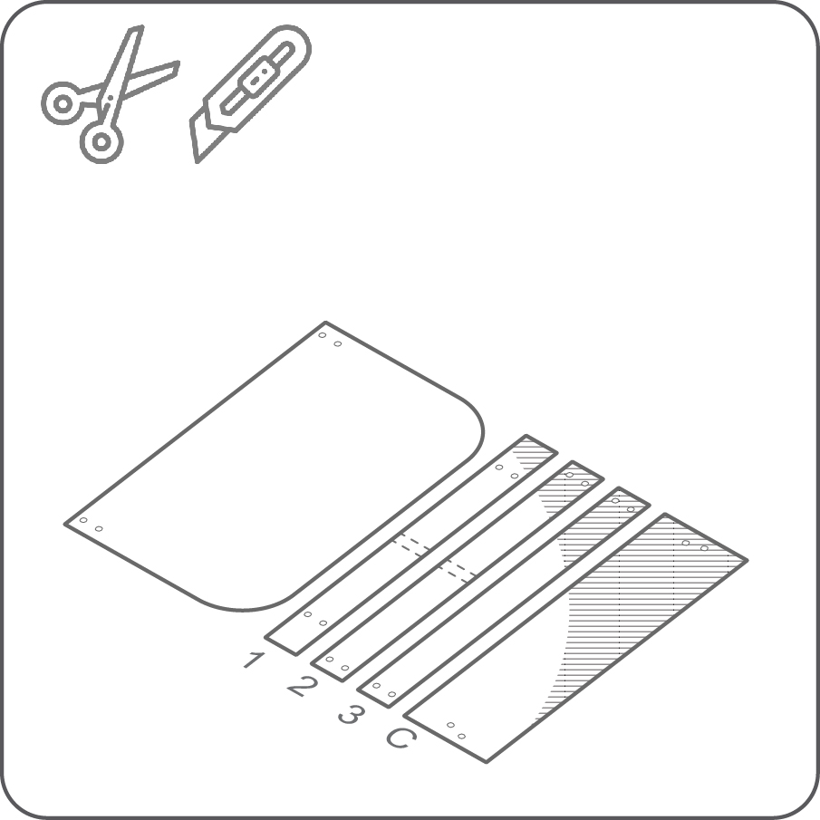
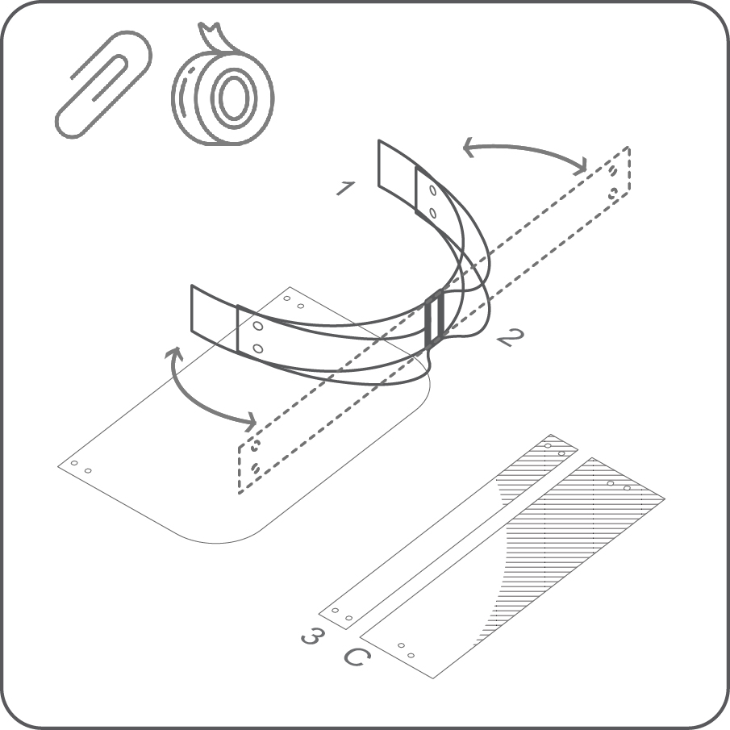

---
layout: page
title: WaveSHIELD
tagline: &nbsp  <a href = "https://github.com/HappyShield/HappyShield/tree/master/Templates/Waveshield" ><i class="em em-triangular_ruler" aria-role="presentation" aria-label="TRIANGULAR RULER"></i></a>
permalink: /wave-shield/tr/
language: tr
---

<i class="em em-timer_clock" aria-role="presentation" aria-label=""></i>: 10-15′

---

<iframe src="https://snapwidget.com/embed/812110" class="snapwidget-widget" allowtransparency="true" frameborder="0" scrolling="no" style="border:none; overflow:hidden;  width:100%; "></iframe>

---

---

## Sorumluluk Reddi

---

Cambridge Üniversitesi (UC) ve Queensland Üniversitesi (UQ), HappyShield'ın tasarımı, özellikleri, dayanıklılığı, uygun kullanımı veya performansı hakkında, satılabilirlik ve belirli bir amaca uygunluk hakkındaki zımni garantiyle sınırlı kalmamak üzere, açık veya zımni hiçbir garanti vermemektedir. HappyShield, sıvılara ve spreylere maruz kalmayı en aza indirecek şekilde tasarlanmıştır, ancak UC ve UQ, HappyShield'ın kullanıcıları COVID-19 enfeksiyonundan veya başka bulaşıcı hastalıklardan koruyacağını garanti etmez. Bu materyaldeki hiçbir şey tıbbi tavsiye oluşturmaz ve kullanıcılar HappyShield'in amaçladıkları kullanıma uygun olup olmadığı ve diğer tıbbi veya başka türden stratejilerle birlikte kullanmaları gerekip gerekmediği konusunda kendi tıbbi tavsiyelerini takip etmelidirler. Yasaların izin verdiği azami ölçüde, UC ve UQ tüm zımni garantileri, güvenceleri, şartları ve koşulları hariç tutar. UC ve UQ, HappyShield'ın kullanımından kaynaklanan mülki hasar, bedensel yaralanma veya hastalık, ölüm, dolaylı, özel veya buna bağlı zararlar (“Talepler”) dahil ancak bunlarla sınırlı olmamak üzere herhangi bir hak, talep, hasar veya yaralanmadan sorumlu değildir, ve HappyShield kullanıcıları UC ve UQ'yu ve memurlarını, çalışanlarını, yüklenicilerini ve temsilcilerini tüm Taleplerden muaf tutar.

---

--- 

## Araçlar

---

* Makas ya da maket bıçağı
* Tükenmez kalem

---

## Malzemeler

---

**Siperlik**

* 0.5 mm kalınlığında polietilen tereftalat (PET) ya da en azından asetat levha 
* 20 mm genişliğinde elastik bant (%70 polyester %30 kauçuk)
* Bant

---

---

# Talimatlar

---

# 1 

Şablon biçiminizi indirin (A3 siperlikler için A4, Tabloid siperlikler için Letter). Yazıcıya erişiminiz yoksa kendi şablonunuzu çizebilirsiniz. Şablonlarımızın boyutları mevcut!

---

# 2

Şeffaf levhanızı şablonun üzerine yerleştirin. 

---

# 3

Deliklerin yerini tükenmez kalemle işaretleyin. Mürekkep için endişelenmeyin, alkol damlatılmış bir parça bezle silebilirsiniz. Çizgileri ve alttaki eğri köşeleri kesmek üzere işaretleyin. 

---

# 4

Makas ya da maket bıçağı yardımıyla levhaları kesin ve köşelerini düzeltin.

---

# 5

Delikleri kesin. Elinizde varsa kağıt ya da deri delgeci kullanabilirsiniz.

---

# 6

1 ve 2 nolu şeritleri ortadan bantlayın, delikleri aynı hizaya geldiğinde şeritlerin M şeklini oluşturduğundan emin olun. Simetrik olması lazım.

---

# 7

Şeritlerin deliklerini hizalayın. İçeriden dışarıya doğru sıralama şu şekilde olmalıdır: 1,2,3, yüz siperliği ve üst örtü. Şeritleri elastik bant ile bağlayın. Bantın üst delikten dışarıya doğru çıkması ve alt delikten içeriye doğru girmesi gerekiyor.

---

# 8

Maskeniz şu anda hazır.

---

