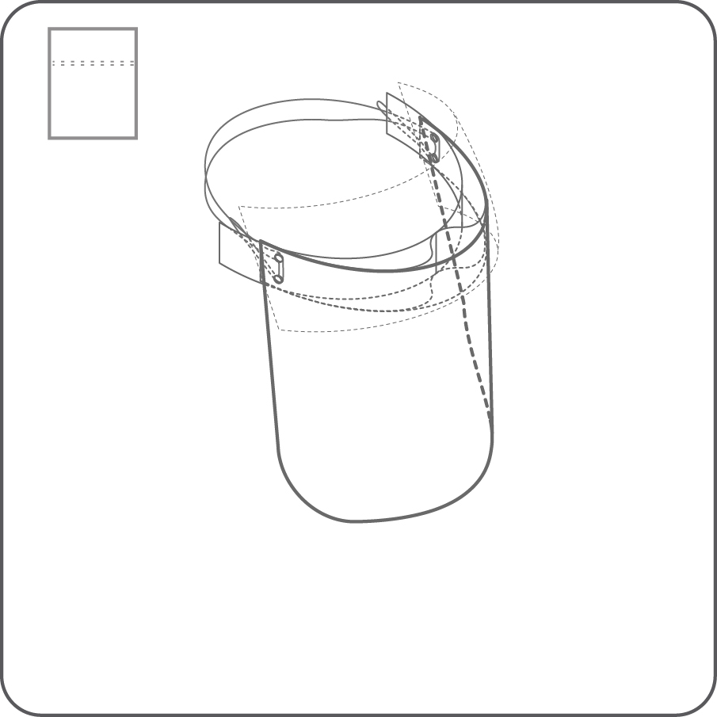

---
layout: page
title: WaveSHIELD
tagline: &nbsp  <a href=""><i class="em em-video_camera" aria-role="" ><i class="em em-triangular_ruler" aria-role="presentation" aria-label="TRIANGULAR RULER"></i></a>
permalink: /wave-shield/en/
---

<i class="em em-timer_clock" aria-role="presentation" aria-label=""></i>: 10-15′

---

<iframe src="https://snapwidget.com/embed/810064" class="snapwidget-widget" allowtransparency="true" frameborder="0" scrolling="no" style="border:none; overflow:hidden;  width:100%; "></iframe>

---

---

## Disclaimer

---

The University of Cambridge (UC) and the University of Queensland (UQ) make no warranty of any kind, express or implied, about the design, characteristics, durability, proper use or performance of the HappyShield, including but not limited to implied warranties of merchantability and fitness for any particular purpose. The HappyShield is designed to minimise exposure to fluids and sprays, but UC and UQ do not warrant that HappyShield will protect users from COVID-19 infection or any other infectious disease. Nothing in this material constitutes medical advice, and users should seek their own medical advice about whether HappyShield is suitable for the use they intend, and whether they should use it in conjunction with any other medical or other strategies. To the fullest extent allowed by law, UC and UQ exclude all implied warranties, guarantees, terms and conditions. UC and UQ are not liable for any claims, demands, damages or injuries, including but not limited to property damage, bodily injury or illness, death, indirect, special or consequential damages (“the Claims”) arising out of using the HappyShield, and users of HappyShield release UC and UQ and their officers, employees, contractors and agents from all Claims.

---

--- 

## Tools

---

* Scissors or razor blade
* Ballpoint pen

---

## Materials

---

**Shield**

* 0.5 mm thick Polyethylene terephthalate (PET) or Acetate sheet at least 
* 20 mm wide knit elastic strap (70% polyester 30% rubber)
* Tape

---

---

# Instructions

---

# 1 

Download your tracing template format (A4 for A3 shields, Letter for Tabloid shields). If you do not have access to printers, you can draw your own template. Our tracing templates have dimensions!
---

# 2

Place your transparent sheet on the template. 

---

# 3

Mark the holes’ location with a ballpoint pen. Don’t worry about the ink, it can be removed with a cloth damped with alcohol. Mark the lines and the lower round corners for cutting. 

---

# 4

With scissors or a cutter cut the sheets and trim the corners of the shield.

---

# 5

Cut the holes. You can use a paper or leather punch¬er if you have.

---

# 6

Tape the middle of strip 1 and 2, check the M shape the two strips made when the holes are aligned. It should be symmetrical.

---

# 7

Align the holes together strips. The order from inside to outside is: 1,2,3, face-shield, and top cover. Tie the sheets with the elastic band. It should come out from upper hole and go in the lower hole.

---

# 8

Your mask is ready now.

---

