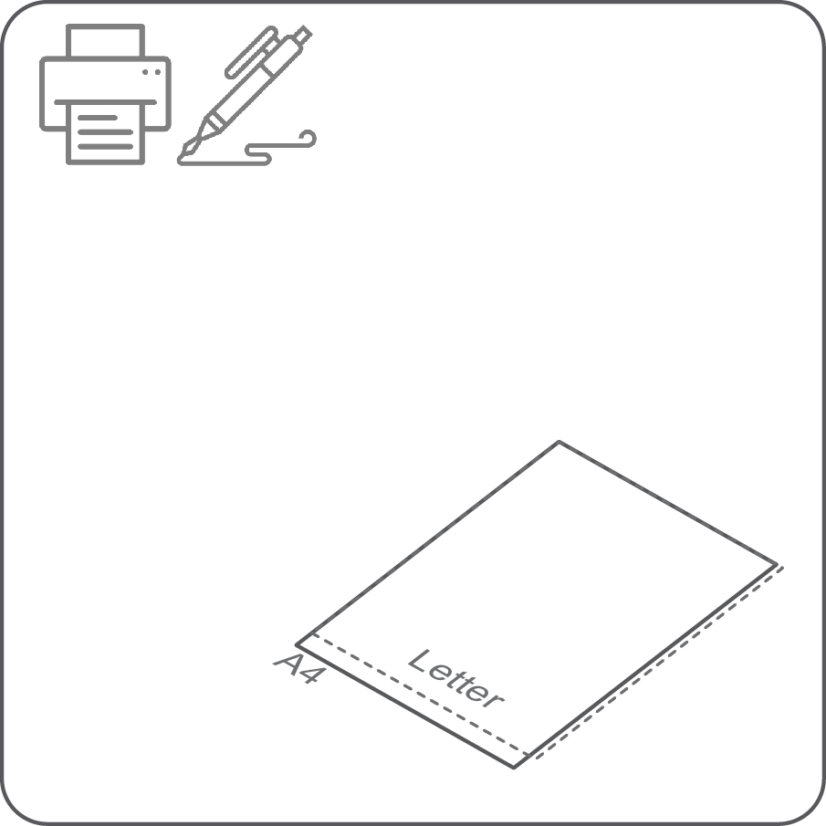

---
layout: page
title: Viseira Ondulada
tagline: &nbsp  <a href = "https://github.com/HappyShield/HappyShield/tree/master/Templates/Waveshield" ><i class="em em-triangular_ruler" aria-role="presentation" aria-label="TRIANGULAR RULER"></i></a>
permalink: /wave-shield/en/
---

<i class="em em-timer_clock" aria-role="presentation" aria-label=""></i>: 10-15′

---

---

## Aviso Legal (Disclaimer)

---

The University of Cambridge (UC) and the University of Queensland (UQ) make no warranty of any kind, express or implied, about the design, characteristics, durability, proper use or performance of the HappyShield, including but not limited to implied warranties of merchantability and fitness for any particular purpose. The HappyShield is designed to minimise exposure to fluids and sprays, but UC and UQ do not warrant that HappyShield will protect users from COVID-19 infection or any other infectious disease. Nothing in this material constitutes medical advice, and users should seek their own medical advice about whether HappyShield is suitable for the use they intend, and whether they should use it in conjunction with any other medical or other strategies. To the fullest extent allowed by law, UC and UQ exclude all implied warranties, guarantees, terms and conditions. UC and UQ are not liable for any claims, demands, damages or injuries, including but not limited to property damage, bodily injury or illness, death, indirect, special or consequential damages (“the Claims”) arising out of using the HappyShield, and users of HappyShield release UC and UQ and their officers, employees, contractors and agents from all Claims.

---

--- 

## Ferramentas

---

* Tesoura ou lâmina de corte
* Caneta esferográfica

---

## Materiais

---

**Viseira**

* Polietileno tereftalato (PET) com 0,5 mm de espessura ou como alternativa uma folha de acetato
* Fita elástica larga de 20 mm (70% poliéster 30% borracha)
* Fita Adesiva

---

---

# Instruções

---

# 1 

Descarregue o modelo para o formato pretendido (A4 para viseiras A3, "tipo carta" para viseiras "tipo tablóide"). Se não tiver acesso a uma impressora, pode desenhar o seu próprio modelo. Os nossos modelos têm dimensões!

---

# 2

Coloque a folha transparente em cima do modelo. 

---

# 3

Marque a localização dos círculos com a caneta esferográfica. Não se preocupe com a tinta, pode ser removida posteriormente com um pano embebido em álcool. Marque as linhas e os limites inferiores para cortar. 

---

# 4

Com uma tesoura ou lâmina de corte corte a folha transparente e os seus limites inferiores.

---

# 5

Cortes os círculos. Se tiver, pode usar um furador de pele ou de papel.

---

# 6

Fixe com fita adesiva o centro da faixa 1 e 2, confira a forma M que as duas faixas formam quando os círculos estão alinhados. Deve ficar simétrica.

---

# 7

Alinhe os círculos das faixas. A ordem de dentro para fora é: 1,2,3, viseira, parte superior. Segure as faixas com a banda elástica. Deve sair do círculo superior e entrar no círculo inferior.

---

# 8

A sua viseira está pronta.

---

