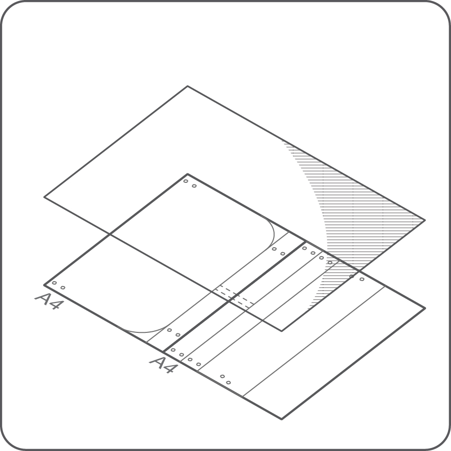

<i class="em em-timer_clock" aria-role="presentation" aria-label=""></i>: 10-15′

---

---

## 免责声明（Disclaimer）

---
剑桥大学（UC）和昆士兰大学（UQ）对HappyShield的设计，特征，耐用性，正确使用或性能不做任何形式的明示或暗示保证，包括但不限于以下隐含保证：适销性和适合任何特定目的。 HappyShield旨在最大程度减少液体和喷雾的接触，但是UC和UQ不保证HappyShield可以保护用户免受COVID-19感染或任何其他传染病的侵害。本材料中的任何内容均不构成医学建议，就HappyShield是否适合其预期用途以及是否能与任何其他医学手段或策略联用，用户须自行征询医学建议。在法律允许的最大范围内，UC和UQ排除所有隐含的担保，保证，条款和条件。 UC和UQ对因使用HappyShield而引起的任何索赔，要求，损害或伤害不承担任何责任，包括但不限于财产损失，人身伤害或疾病，死亡，间接，特殊或附带损失（以下简称“索赔”）。HappyShield的用户不得对UC和UQ及其官员，雇员，承包商和代理商提起以上“索赔”。（具体声明以英文版为准）

The University of Cambridge (UC) and the University of Queensland (UQ) make no warranty of any kind, express or implied, about the design, characteristics, durability, proper use or performance of the HappyShield, including but not limited to implied warranties of merchantability and fitness for any particular purpose. The HappyShield is designed to minimise exposure to fluids and sprays, but UC and UQ do not warrant that HappyShield will protect users from COVID-19 infection or any other infectious disease. Nothing in this material constitutes medical advice, and users should seek their own medical advice about whether HappyShield is suitable for the use they intend, and whether they should use it in conjunction with any other medical or other strategies. To the fullest extent allowed by law, UC and UQ exclude all implied warranties, guarantees, terms and conditions. UC and UQ are not liable for any claims, demands, damages or injuries, including but not limited to property damage, bodily injury or illness, death, indirect, special or consequential damages (“the Claims”) arising out of using the HappyShield, and users of HappyShield release UC and UQ and their officers, employees, contractors and agents from all Claims.

---

--- 

## 工具

---

* 剪刀 或 刻刀
* 圆珠笔

---

## 材料

---

**护罩**

* 0.5 毫米厚的PET聚酯塑片 或者至少是 醋酸纤维塑片 (Acetate sheet) 
* 20 毫米宽的针织松紧带(70%聚酯，30%橡胶)
* 胶带

---

---

# 制作步骤

---

# 1 

下载临摹模板。A4大小(210毫米x297毫米)的模板用于制作A3大小(297毫米x420毫米)的护罩。信纸大小(Letter-sized,216毫米x279毫米)模板用于制作小报大小(Tabloid-sized,279毫米x432毫米)的护罩。如果没有打印机，可按模板上标注的尺寸自行绘制。

---

# 2

将准备的透明塑片放在模板上。

---

# 3

用马克笔或圆珠笔标记两边松紧带孔的位置。不用担心画在塑片上的笔墨，可以用布蘸酒精将其擦去。
标记各线条和下部圆角以用于后续切割。 

---

# 4

用剪刀或刻刀剪切塑片并修剪护罩的边角。

---

# 5

切孔。也可使用纸张或皮革的打孔器打孔。

---

# 6

用胶带将条带1和2的中间缠上，当强行把两条带孔对齐时看是否形成字母M的形状。它们应该是对称的。

---

# 7

将所有孔对齐在一起。从内到外的顺序是：1、2、3，面罩和顶盖。用松紧带绑住这些塑片。松紧带应该从上孔出来然后进入下孔。

---

# 8

你的护罩就做好了！

---

