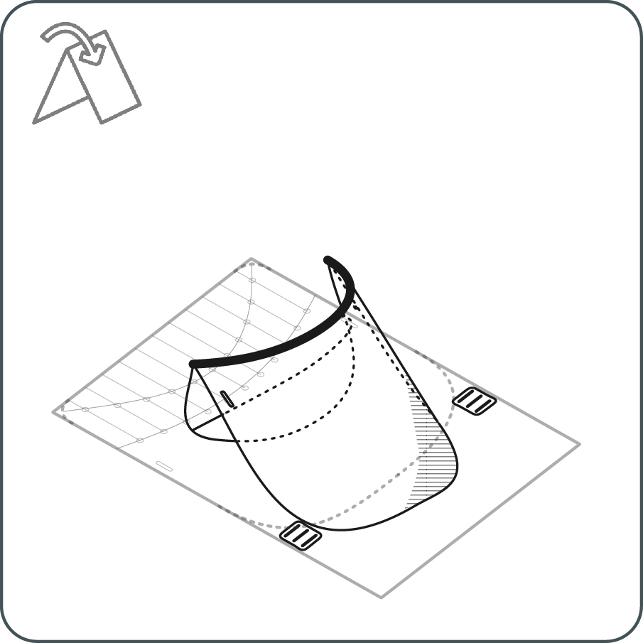

# 1 

Download your tracing template format (A4 for A3 shields, Letter for Tabloid shields). If you do not have access to printers, you can draw your own template. Our tracing templates have dimensions!

<body>
  
But not a bit daunted, Queequeg steered us manfully; now sheering off from this monster directly across our route in advance; now edging away from that, whose colossal flukes were suspended overhead, while all the time, Starbuck stood up in the bows, lance in hand, pricking out of our way whatever whales he could reach by short darts, for there was no time to make long ones. Nor were the oarsmen quite idle, though their wonted duty was now altogether dispensed with. They chiefly attended to the shouting part of the business. "Out of the way, Commodore!" cried one, to a great dromedary that of a sudden rose bodily to the surface, and for an instant threatened to swamp us. "Hard down with your tail, there!" cried a second to another, which, close to our gunwale, seemed calmly cooling himself with his own fan-like extremity.

All whaleboats carry certain curious contrivances, originally invented by the Nantucket Indians, called druggs. Two thick squares of wood of equal size are stoutly clenched together, so that they cross each other's grain at right angles; a line of considerable length is then attached to the middle of this block, and the other end of the line being looped, it can in a moment be fastened to a harpoon. It is chiefly among gallied whales that this drugg is used. For then, more whales are close round you than you can possibly chase at one time. But sperm whales are not every day encountered; while you may, then, you must kill all you can. And if you cannot kill them all at once, you must wing them, so that they can be afterwards killed at your leisure. Hence it is, that at times like these the drugg, comes into requisition. Our boat was furnished with three of them. The first and second were successfully darted, and we saw the whales staggeringly running off, fettered by the enormous sidelong resistance of the towing drugg. They were cramped like malefactors with the chain and ball. But upon flinging the third, in the act of tossing overboard the clumsy wooden block, it caught under one of the seats of the boat, and in an instant tore it out and carried it away, dropping the oarsman in the boat's bottom as the seat slid from under him. On both sides the sea came in at the wounded planks, but we stuffed two or three drawers and shirts in, and so stopped the leaks for the time.

</body>

---

# 2

Place your transparent sheet on the template. Mark the holes’ location with a ballpoint pen. Don’t worry about the ink, it can be removed with a cloth damped with alcohol. 

---

# 3

Mark the strap holders and the lower and upper round corners for cutting.

# 4	

With scissors or a cutter trim the corners. Cut the strap holders and make the holes, you can use a paper puncher if you have. 
Now, let’s score a smile on that face!

---

## Creasing Method A

# 5A

Place your transparent sheet on the template. Fix with clips or tape for precise tracing.

# 6A

With a ruler and the ballpoint pen, trace the straight segments of the first curve with multiple strokes until scored. 

# 7A

Flip the transparent sheet.  Fix the sheet and the template again.

# 8A

Trace the second curve with the ruler and the pen.

---

## Creasing Method B

# 5B	

Trace the folding curves with a pen

# 6B

Make a 2-5 mm gap in a wooden piece. You can also use the gaps between floorboards, kitchen top, dining table. Use the gap as a channel and crease with the dull side of a butter knife.

# 7B

Flip the mask

# 8B

Do the second curve on the other side. 

---

# 9

To fold the first curve, start with one corner, if some segments does not fold, score again with the pen and ruler. 

# 10

Fold the second curve.

# 11	

Fix the strap using the holders you cut from the template.

# 12

Clean and use, clean and place in zip bag for shipping.

