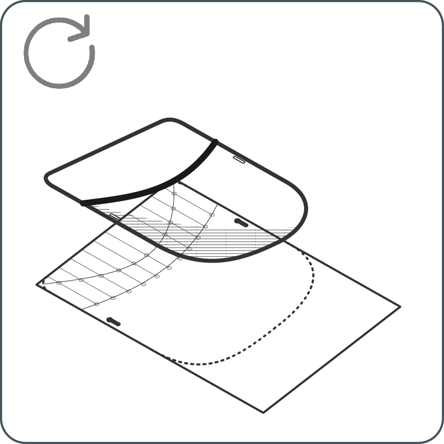
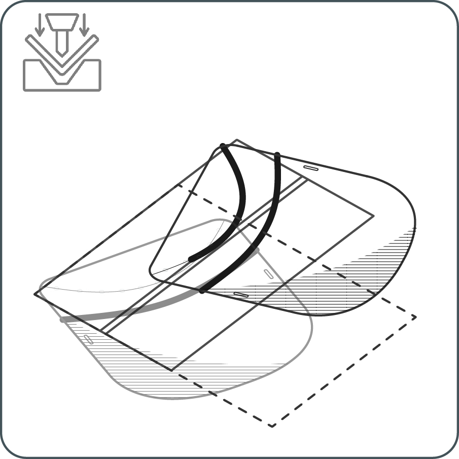

<i class="em em-timer_clock" aria-role="presentation" aria-label=""></i>: 10-15 m

---

<iframe src="https://snapwidget.com/embed/809985" class="snapwidget-widget" allowtransparency="true" frameborder="0" scrolling="no" style="border:none; overflow:hidden;  width:100%; "></iframe>

# 1 

Download your tracing template format (A4 for A3 shields, Letter for Tabloid shields). If you do not have access to printers, you can draw your own template. Our tracing templates have dimensions!

---

# 2

Place your transparent sheet on the template. Mark the holes’ location with a ballpoint pen. Don’t worry about the ink, it can be removed with a cloth damped with alcohol. 

---

# 3

Mark the strap holders and the lower and upper round corners for cutting.

---

# 4

With scissors or a cutter trim the corners. Cut the strap holders and make the holes, you can use a paper puncher if you have. 
Now, let’s score a smile on that face!

---

## Creasing Method A

---

# 5A

Place your transparent sheet on the template. Fix with clips or tape for precise tracing.

---

# 6A

With a ruler and the ballpoint pen, trace the straight segments of the first curve with multiple strokes until scored. 

---

# 7A

Flip the transparent sheet.  Fix the sheet and the template again.

---

# 8A

Trace the second curve with the ruler and the pen.

---

## Creasing Method B

---

# 5B	

Trace the folding curves with a pen.

---

# 6B

Make a 2-5 mm gap in a wooden piece. You can also use the gaps between floorboards, kitchen top, dining table. Use the gap as a channel and crease with the dull side of a butter knife.

---

# 7B

Flip the shield over.

---

# 8B

Do the second curve on the other side. 

---

# 9

To fold the first curve, start with one corner, if some segments do not fold, repeat the creasing procedure. 

---

# 10

Fold the second curve.

---

# 11	

Fix the strap using the holders you cut from the template.

---

# 12 

Clean and use, clean and place in zip bag for shipping.

